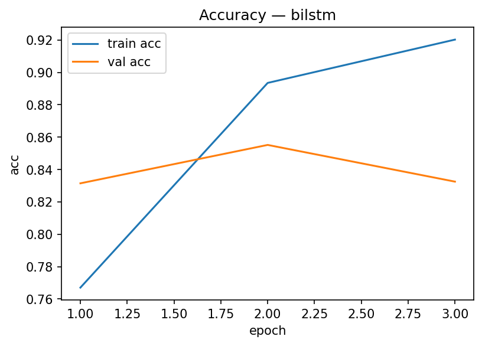
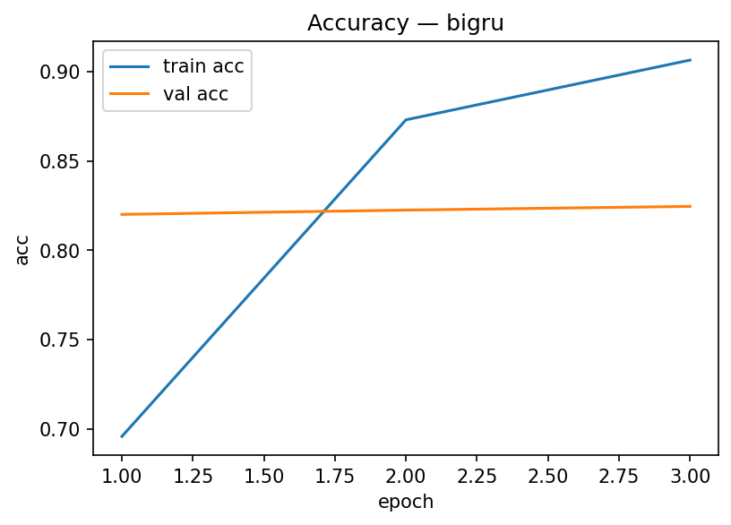
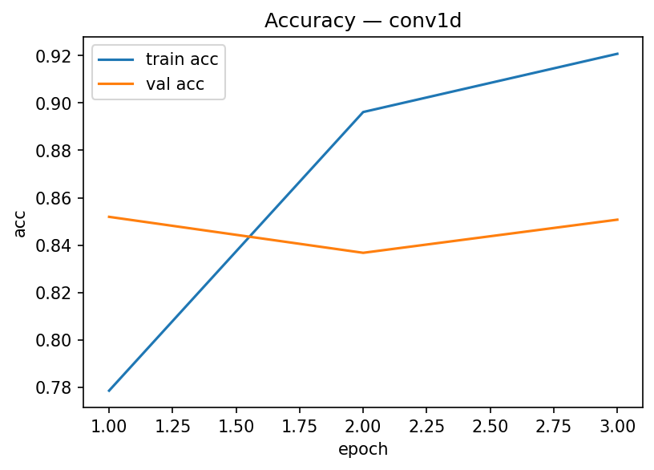
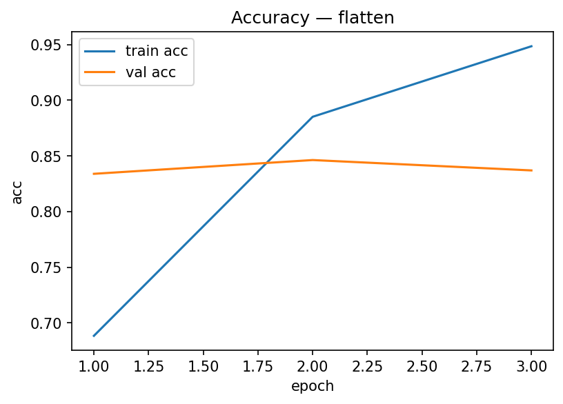
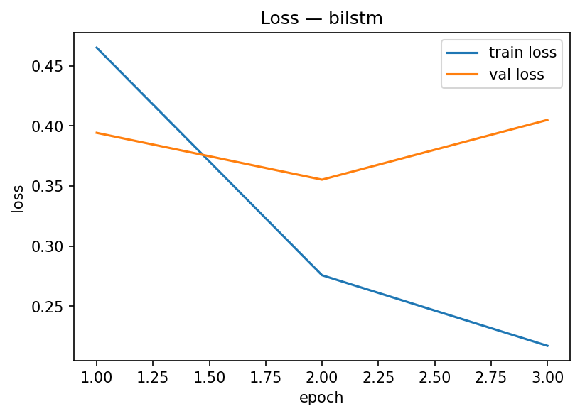
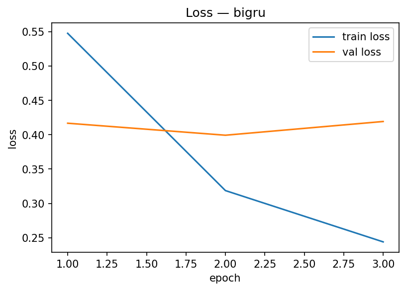
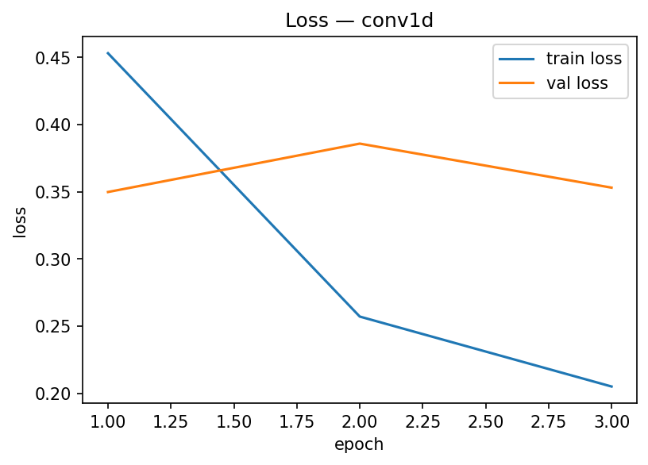
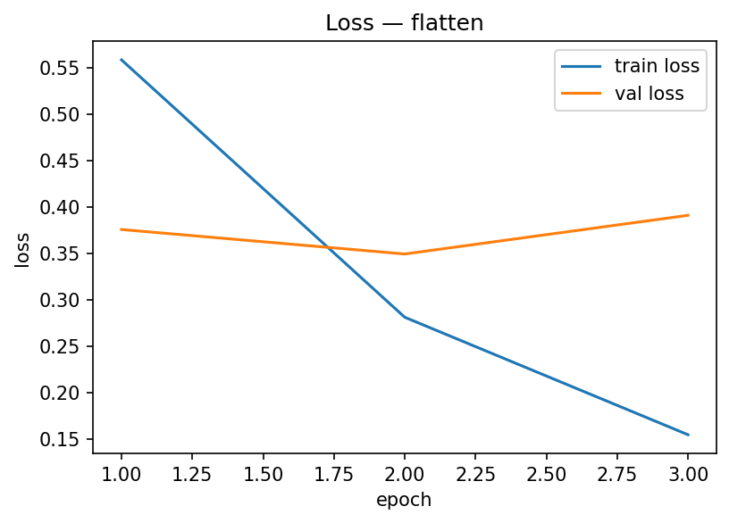

IMDB Sentiment Classification with Stacked BiLSTM

This project demonstrates how to build a stacked bidirectional LSTM model for sentiment classification on the IMDB movie reviews dataset
https://ai.stanford.edu/~amaas/data/sentiment/
. It is part of Week 3 exercise (TensorFlow NLP), focusing on embedding and recurrent architectures.

📂 Project Structure

Multiple_LSTMs_IMDB.ipynb → Jupyter Notebook with full workflow.
artifacts/ → saved models, metrics, and plots (ignored in .gitignore).
requirements.txt → dependencies for reproducibility.

Workflow

Dataset
Source: IMDB Reviews (25k train, 25k test).
Loaded via tensorflow_datasets.

Preprocessing

Text tokenized & padded using TextVectorization.
Vocabulary size: 10,000.
Sequence length: 200.

Model Architecture

Embedding(10000, 64)
Bidirectional(LSTM(64, return_sequences=True))
Bidirectional(LSTM(32))
Dense(64, relu) + Dropout(0.3)
Dense(1, sigmoid)

Training
Optimizer: Adam
Loss: Binary crossentropy
Epochs: 3 (with EarlyStopping)
Batch size: 128

Results

Training metrics (3 epochs):
| Epoch | Train Acc | Val Acc | Train Loss | Val Loss |
| ----- | --------- | ------- | ---------- | -------- |
| 1     | 0.7486    | 0.8435  | 0.4909     | 0.3612   |
| 2     | 0.8925    | 0.8543  | 0.2762     | 0.3571   |
| 3     | 0.9252    | 0.8461  | 0.2003     | 0.4029   |

Accuracy plot
📉 Loss plot
Validation accuracy plateaued around 85%.
Training accuracy continued to increase, while validation loss started to rise → early signs of overfitting.

Insights

Adding multiple LSTM layers increases representational power but also risk of overfitting.
Validation accuracy ~85% is consistent with baseline BiLSTM on IMDB.

To improve:

Use pre-trained embeddings (GloVe, Word2Vec).
Increase regularization (dropout, L2).
Try transformer-based models (BERT/DistilBERT can reach 95%+).

🚀 Next Steps

Extend with GRU and compare vs LSTM.
Replace embedding with pre-trained word vectors.
Showcase RNN → LSTM → Transformer evolution.

## 📊 Model Comparison Results

Berikut hasil training 4 arsitektur pada dataset IMDB Reviews (3 epochs):

### Accuracy
- **BiLSTM**  
  

- **BiGRU**  
  

- **Conv1D**  
  

- **Flatten**  
  

### Loss
- **BiLSTM**  
  

- **BiGRU**  
  

- **Conv1D**  
  

- **Flatten**  
  

🔧 How to Run
git clone https://github.com/milzon1010>/Multiple_LSTMs_IMDB.git
cd Multiple_LSTMs_IMDB
python -m venv .venv
.venv\Scripts\activate
pip install -r requirements.txt
jupyter notebook Multiple_LSTMs_IMDB.ipynb

⚡ This project is a stepping stone in NLP — from sequence models (RNN/LSTM) towards modern Transformer-based LLMs.